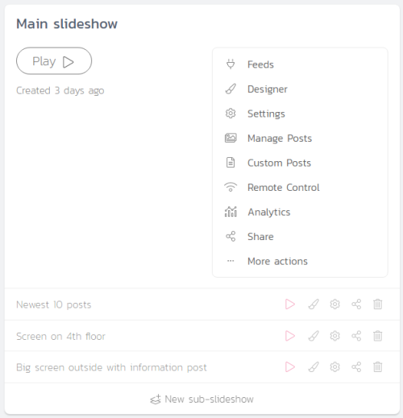
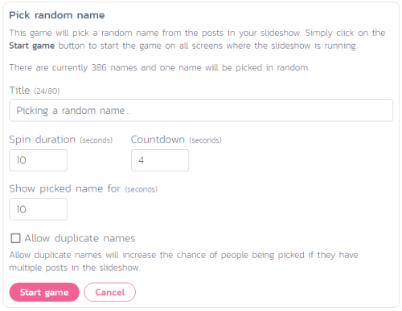
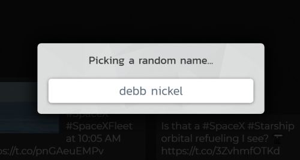

The biggest new feature is the ability to create sub-slideshows for a single slideshow. Sub-slideshows are ideal if you want to create multiple different customization or text filters for a single slideshow. For example, you could create a special sub-slideshow that is optimized for vertical screens and then another sub-slideshow that is optimized for horizontal screens, or you could create a sub-slideshow that has different settings or themes, e.g. only display the newest 10 posts for a special screen or disable the information post, etc.

Another great use case for sub-slideshows is for schools or businesses that have added their Twitter account feed and want to have different text filters for different screens, e.g. #year2 to display posts for second grade. Previously you would have to create many different slideshows with the same feed, which could cause the update time to decrease due to high number of requests made to the Twitter API, but sub-slideshows solve that issue entirely.

> Please note that the moderation, custom posts, remote control and live feeds are shared with all of the sub-slideshows. Here’s a screenshot of a slideshow with 3 sub-slideshows.

Our new Quotes template can be found under our Grid templates. The Quotes template is great if you want to display each post as a quote from the author. The Quotes template is perfect for conferences or any type of event where you want to highlight the author of the post.

We have released our first game in Slidesome called **Pick Random Name**. The game can be found under Remote Control and you can use it to pick a random name from all of the contributors. There are many options available as you can see on the screenshot below.

The game will overlay the entire slideshow while it’s running. You can allow duplicate names, which means that those who have contributed more posts will have higher chance of being picked.

New settings have been added to the Header in the Designer
- Select a background or upload your own 
- Adjust the padding
- Upload a custom logo (Premier plan)

The Edit page has been split into two new pages called Feeds and Settings and the information post settings are now located in the Designer. This was primarily done to make it easier to adjust the settings for sub-slideshow and to improve overall user experience. 

We also included a lot of fixes, tweaks and performance improvements in this latest update.

Your feedback is always welcome so let us know if you have any [questions or comments](https://slidesome.com/contact/). 

[Get started today for free](https://slidesome.com)
