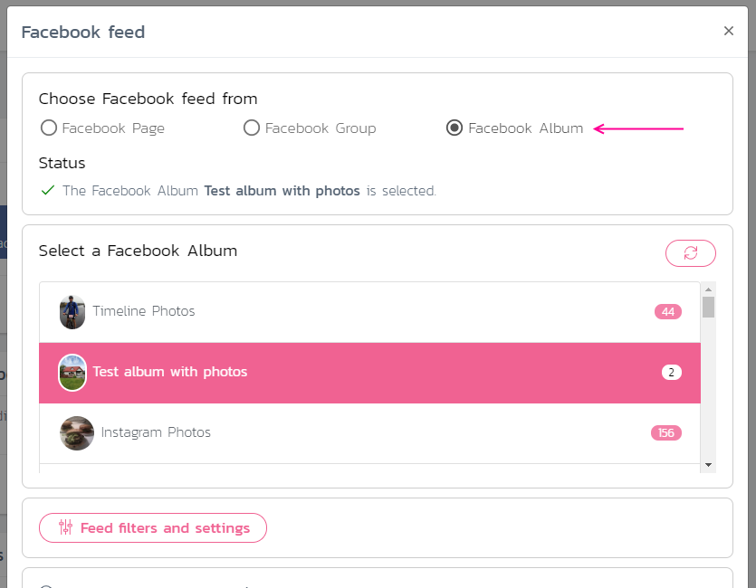

> Adding a Facebook Album feed is ideal if you want to display personal photos from one or more of your Facebook Albums in your slideshow.
> Please note that we are currently not able to fetch videos from your Facebook Albums.

**Please follow these steps to add a Facebook Abum to your slideshow**
1. Sign in to your Slidesome account.
2. Open the *Feeds* page for your existing or newly created slideshow.
3. Click on the Facebook button under *Add new Feed*.
4. Choose *Facebook Album* under *Choose Facebook feed from*.

 

Your feedback is always welcome, [please let us know if you have any questions or comments](https://slidesome.com/contact/).

> [Get started today for free](https://slidesome.com)
