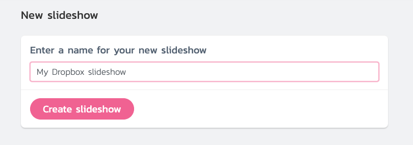
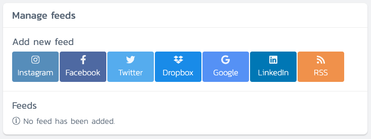
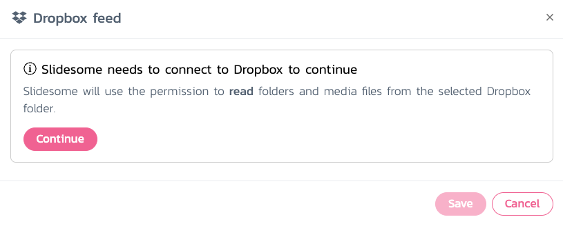
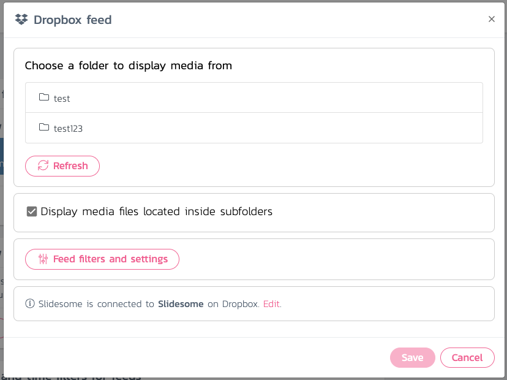
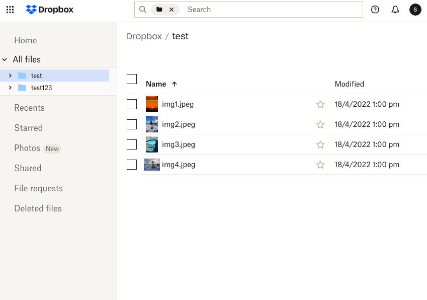

> Slidesome fetches new photos from your Dropbox folder every minute in our paid plans. This means you can invite people to upload media files to your Dropbox folder and they will be displayed in your slideshow in real-time.

How do I set up my own Dropbox slideshow? Start by signing up on https://slidesome.com and then create your first slideshow.

After your slideshow has been created, you will have to add one or more feeds to it. In this case we just want to add a Dropbox feed. Click on the Dropbox button.

You will be asked to connect Dropbox to your Slidesome account. This step is required so that we can fetch your Dropbox folders and media. Click on the <i>Connect</i> button and continue.

You should see all Dropbox folders listed that exist on your Dropbox account after you have granted Slidesome access to your Dropbox account. Click on the folder that you want to display media from and then click on <i>Save</i>. In this case we have selected the folder <i>test</i>.

Here are the same folders listed on https://dropbox.com for reference. We can see that there are 4 photos in the folder test, which should be displayed in our newly created slideshow.

And here is the slideshow displaying photos from our Dropbox folder! Please note that you need to upgrade to our paid plans if you want to be able to customize your slideshow.

Your feedback is always welcome, [please let us know if you have any questions or comments](https://slidesome.com/contact/).

> [Get started today for free](https://slidesome.com)
