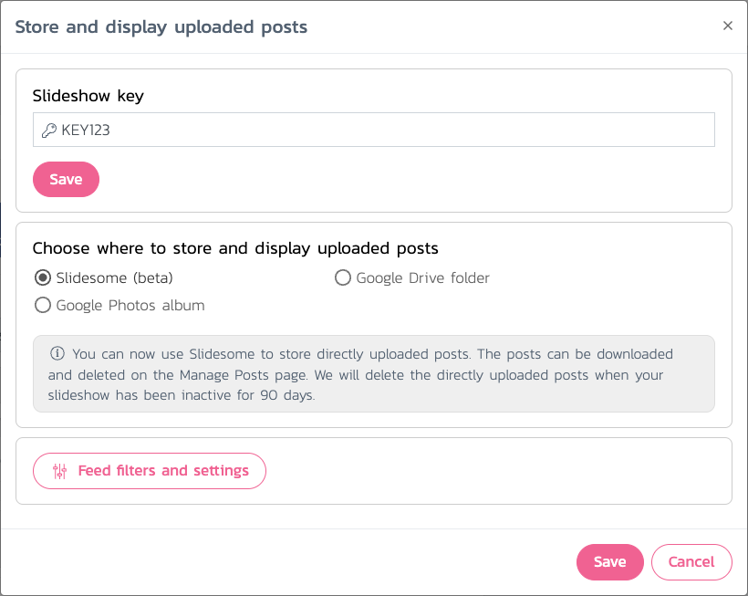
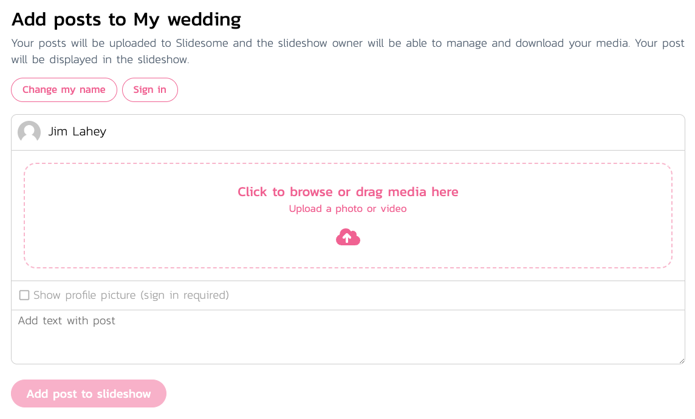

<h4>Directly upload posts to Slidesome</h4>

Directly uploaded posts can now be stored with Slidesome instead of using Google Drive or Google Photos. Storing posts with Slidesome also allows your guests to upload text posts to your slideshow. Directly uploaded posts can be downloaded and deleted on the Manage Posts page for your slideshow.

Please note that you have up to 90 days to save all directly uploaded posts after your slideshow becomes inactive. After that time all directly uploaded posts will be deleted unless your slideshow becomes active again.

 

<h4>Improvements to the direct upload website</h4>

The direct upload website has been improved to reduce the friction of entering a slideshow. For example if you make sign in optional, then your guests will no longer see the <i>Sign in</i> step before entering the slideshow, instead it will be optional after entering the slideshow.

<h4>Support for Dropbox Team folders</h4>

You can now choose Dropbox Team folders in Slidesome for your slideshow. This feature makes it easier for organisations to share content on Slidesome, e.g. if employees have a shared Team folder.

> [Learn how to create your first Dropbox slideshow](../2022-04-18-how-to-create-dropbox-slideshow/)

We have also made many small improvements and fixes to the Slidesome website and app. Your feedback is always welcome, <a href="https://slidesome.com/contact/">please let us know if you have any questions or comments</a>.

