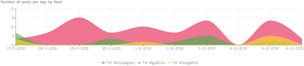
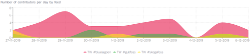
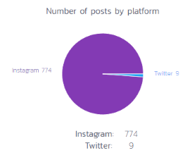
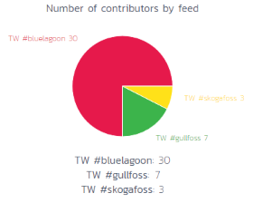
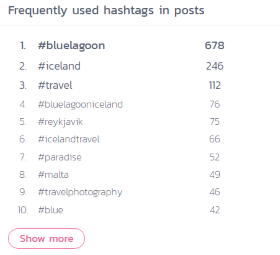

We're thrilled to announce our latest features which include support for LinkedIn and RSS feeds as well as relative time filter for feeds. We also added support for right to left languages on Twitter, new information post frequency, notifications for payments and of course plenty of fixes and tweaks!

The new Analytics page allows you to see number of posts per day by platform and feed, total number of contributors by platform and feed, number of contributors per day by platform and feed, frequently used hashtags in posts and top contributors.

**Number of posts per day by feed** can help you see which hashtags on a single platform are performing well. Here’s an example that shows three popular locations in Iceland, #bluelagoon, #gullfoss and #skogafoss. You can clearly see that #bluelagoon is more popular than the other hashtags on Twitter.

**Number of contributors per day by feed** can help you see how many unique users contributed to each feed. The graph looks very similar to the number of posts per day by feed, since most posts are from unique users.

**Number of posts by platform** can help you see which platforms are most popular with your hashtag. The example pie chart below shows that Instagram is currently the most popular social media platform for the hashtag #bluelagoon

**Number of contributors by feed** can help you see which feed is most popular.

**The frequently used hashtags** shows you what hashtags are popular in the fetched posts. This could give you insights to what other hashtags you could be following, create hashtag game and more! Here’s a preview of frequently used hashtags from posts with the hashtag #bluelagoon. You can see that people are also using #bluelagooniceland which could help brands explore new hashtags to follow.

The Premier plan also allows you to request for hashtagged tweets back in time once per month, for a single Twitter hashtag feed. Open the Feeds page for your slideshow, click on the Twitter hashtag feed, click on the ‘Feed filters and settings’ button and then click on ‘Request for tweets back in time (0/1)` and remember to click on Save afterwards. We will fetch up to 1,000 posts back in time since 2006.

We also increased the number of posts we store per feed. All of our plans were limited to around 2,500 - 3,000 posts per feed, but now we offer up to 5,000 posts per feed in our Professional plan and 10,000 posts per feed in our Premier plan.

Last but not least the Premier plan gives you the ability to easily brand your slideshow as you can now upload a custom logo in the designer.

> Check out our [pricing page](https://slidesome.com/pricing/) to compare the plans. 

