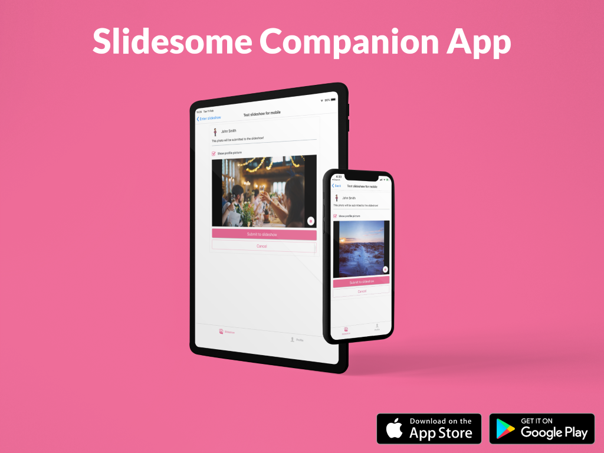

We are incredibly excited to announce that the Slidesome companion app is now available for both Android and iOS devices. The companion app makes it easier than ever to post photos and videos to slideshows powered by Slidesome.

How does it work? Your guests or users can get the Slidesome app on their mobile phone or tablet through the [App Store](https://apps.apple.com/us/app/slidesome/id1498111136) or [Google Play](https://play.google.com/store/apps/details?id=com.slidesome.mobileapp), enter the slideshow key or scan the QR code, sign in if it’s required and start posting!

The Slidesome app uploads the media directly to the Google Photos or Google Drive folder that the slideshow owner has selected, so there is no need to post to social media. Giving people an easy way to post to slideshows without posting to social media is ideal for private events where you want to capture as many memories as possible. 

Please note that this is the first version of the app and we have a lot of features still on the drawing board. We will be working on polishing existing features as well as adding more in the coming months.

Your feedback is always welcome, [please let us know if you have any questions or comments](https://slidesome.com/contact/) about the Slidsome Companion App.

> Visit [Slidesome](https://slidesome.com) today to create your free slideshow!
