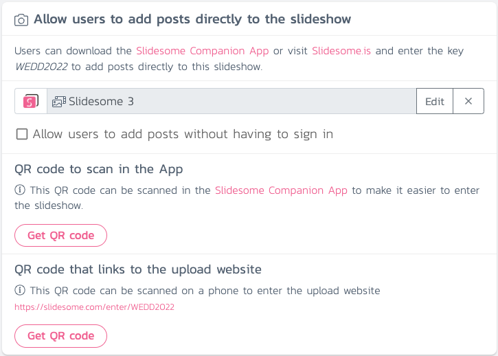

> Slidesome will show new media in your slideshow in real-time when using direct upload. The media will be uploaded to your own Google Drive folder or Google Photos album.

How do I set up my own direct upload slideshow? Start by signing up on https://slidesome.com and then create your first slideshow.

After your slideshow has been created, you will have to add one or more feeds to it. In this case we want to enable direct uploads. Under "Allow users to add posts directly to the slideshow" click on "Enable" as seen on the screenshot below.

> You can have multiple feeds in your slideshow, e.g. direct upload feed and Instagram hashtag feed.
The Basic free plan allows up to 20 direct uploads, which is great for testing purposes. The Plus plan allows 100 direct uploads and the Professional and Premier plan have no limits. Click on Next to continue.

You will now be asked to enter a unique key for your slideshow. This key is required for your users to have access to upload directly to your slideshow. We recommend entering a key that is easy to remember. You can also get a QR code in the last step. After entering your unique key, click on Next to continue.

> We recommend using a key that is easy to remember.
The final step will ask you where you want the media to be uploaded. You can choose to have the media uploaded to your own Google Drive folder or Google Photos album. Please note that Google Drive has limits such as how much storage space you have left and bandwidth limit. We often recommend using Google Photos over Google Drive.

After you have selected a Google Drive folder or Google Photos album click on Save. You will now be able to get QR code for the Slidesome Companion App, and a QR code that links to the direct upload website. The website is ideal for users who don't want to download our app.

And here is the slideshow displaying photos from our Dropbox folder! Please note that you need to upgrade to our paid plans if you want to be able to customize your slideshow.

Your feedback is always welcome, [please let us know if you have any questions or comments](https://slidesome.com/contact/).

> [Get started today for free](https://slidesome.com)
